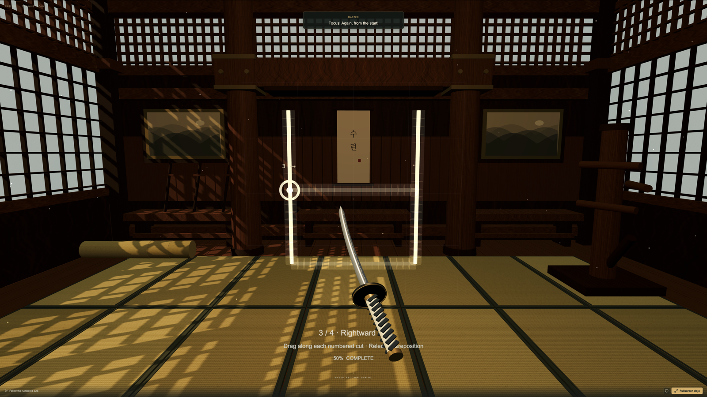

# Hangul Ninja



Learn to recognize and draw Hangul through katana flow cuts in a stationary 3D dojo. Hangul Ninja is a browser-based WebXR prototype for Meta Quest Browser, with a desktop preview for playing and development without a headset.

## Features

- Six guided levels covering 40 Hangul characters.
- A timber dojo you can look around in VR, with controller-held katanas and glowing tip trails.
- Ordered straight, diagonal, and curved cuts, with demonstrations and progress feedback.
- Bundled Korean pronunciation and master dialogue, with English translations above the dojo.
- Rotating encouragement and anime celebrations that remain visible until replaced or cleared by a mistake.
- Sword effects and optional background music. Music starts enabled at a low volume after the first interaction.

## Install and run

### Requirements

- Node.js 22.18 or newer, with npm.
- Git if you are cloning the repository; alternatively, use an extracted source download.
- A desktop browser with WebGL for the preview.
- For VR: a Meta Quest headset, its controllers, and Meta Quest Browser.

No headset, database, API key, or locally installed Korean voice is needed for desktop development. Korean voice clips are included in `public/audio/`.

### 1. Get the source

Clone this repository using its actual Git URL. Replace `YOUR_REPOSITORY_URL` below; it is a placeholder for your repository URL.

```sh
git clone YOUR_REPOSITORY_URL hangul_ninja
cd hangul_ninja
```

If you already have the source, open a terminal in the directory containing `package.json`. Keep the included `.openai/hosting.json` file: the Vite configuration imports it.

### 2. Install dependencies

Check your runtime and install the versions recorded in the lockfile:

```sh
node --version
npm --version
npm ci
```

### 3. Start the game

```sh
npm run dev
```

Open the local URL printed in the terminal, normally **http://localhost:3000/**. Keep the terminal running while you play. Press **Ctrl+C** to stop the server.

To expose the development server to other devices on your network:

```sh
npm run dev -- --host 0.0.0.0
```

This enables network access for desktop previewing. It does not provide the HTTPS connection needed for immersive VR on a headset.

## Docker and Google Cloud Run

The Docker image builds a Node version of the game and runs Vinext’s production HTTP server as an unprivileged user. It listens on `0.0.0.0` and the `PORT` environment variable (8080 by default). Cloud Run provides the HTTPS endpoint required by Quest Browser.

The Docker build sets `HANGUL_DEPLOY_TARGET=node` to omit the Sites and Cloudflare runtime plugins. It includes the game and bundled audio without an application sign-in layer. The existing `npm run build` / `npm start` workflow continues to target Sites/Cloudflare.

### Build and test the container

Start Docker Desktop (or another Docker engine), then run from the repository root:

```sh
docker build --platform linux/amd64 -t hangul-ninja:cloud-run .
docker run --rm --name hangul-ninja -p 8080:8080 -e PORT=8080 hangul-ninja:cloud-run
```

Open **http://localhost:8080/** for the desktop preview. The explicit platform also produces a Cloud Run-compatible image when building on an Apple Silicon Mac. Stop the container with Ctrl+C, or run `docker stop hangul-ninja` in another terminal.

### Deploy to your Google Cloud project

Replace `YOUR_PROJECT_ID`, `YOUR_REGION`, and `YOUR_SERVICE_NAME` with your own Google Cloud project ID, deployment region, and chosen service name. The project must have billing enabled, and your Google account must have permission to build and deploy Cloud Run services.

Authenticate and enable the required APIs:

```sh
gcloud auth login
gcloud services enable run.googleapis.com cloudbuild.googleapis.com artifactregistry.googleapis.com --project=YOUR_PROJECT_ID
```

Build and deploy directly from this directory; Cloud Build uses the included Dockerfile, so no local image push is necessary:

```sh
gcloud run deploy YOUR_SERVICE_NAME \
  --project=YOUR_PROJECT_ID \
  --region=YOUR_REGION \
  --source=. \
  --port=8080 \
  --cpu=1 \
  --memory=512Mi \
  --min-instances=0 \
  --max-instances=2 \
  --no-allow-unauthenticated
```

This command keeps the service private using Cloud Run IAM. It does not create an in-game login page. For a private desktop smoke test, run:

```sh
gcloud run services proxy YOUR_SERVICE_NAME --project=YOUR_PROJECT_ID --region=YOUR_REGION --port=8080
```

Then open **http://localhost:8080/**. Direct access from Quest Browser needs a browser-compatible authentication solution or public access. If you want **anyone with the URL** to play, replace `--no-allow-unauthenticated` with `--allow-unauthenticated` in the deployment command. Organization policy may restrict public access.

Find the deployed HTTPS URL:

```sh
gcloud run services describe YOUR_SERVICE_NAME --project=YOUR_PROJECT_ID --region=YOUR_REGION --format='value(status.url)'
```

Subsequent deployments use the same `gcloud run deploy` command. Cloud Build, Artifact Registry, and Cloud Run can incur charges; scaling to zero does not eliminate build or image-storage costs.

If deployment reports an IAM error, have your project administrator check the deployer’s Cloud Run Source Developer, Service Usage Consumer, and Service Account User permissions, and the build service account’s Cloud Run Builder role. See Google’s [source deployment instructions](https://docs.cloud.google.com/run/docs/deploying-source-code) and [container requirements](https://docs.cloud.google.com/run/docs/container-contract).

## Play on desktop

1. Select **Begin Level 1**.
2. Hold the mouse button or touch and drag to hold the katana at its grip. Guide the offset blade tip through the numbered cuts in order.
3. Release between cuts to reposition. Completed cuts remain lit; an unfinished cut restarts when released.
4. Use **Watch this character** for a demonstration or **Hear** to replay pronunciation.

For keyboard practice, focus the dojo, hold **Space**, and move with the **arrow keys**. Press **R** to restart the current character. Touch dragging is also supported.

After a successful character, the next one appears automatically after three seconds. At the end of a level, confirm **I’m ready** in the center panel to advance, or choose to practice the level again. Completing Level 6 offers a restart from Level 1.

## Play in Meta Quest Browser

The game runs in the browser; no APK installation is required.

1. Open an **HTTPS deployment** of the game in Meta Quest Browser.
2. Select **Enter VR** and allow the immersive session if prompted.
3. Press a controller trigger to begin. Hold the trigger while sweeping the katana tip through the guide, then release to reposition.
4. Turn your head to look around the dojo. Squeeze the controller grip to recenter the guide in front of you.
5. Release the trigger after completing a character. The next character appears automatically; at a level boundary, press the trigger to confirm advancement.
6. Exit VR using the Quest system menu.

A headset’s `localhost` refers to the headset itself, not your development computer. To test a local checkout in immersive VR, provide a trusted HTTPS endpoint to the development server or deploy the application over HTTPS. A plain `http://192.168.…` LAN address is insufficient for immersive WebXR.

The player remains stationary, with no artificial locomotion. Use a clear play space within your headset’s boundary.

## Levels

| Level | Group | Characters |
| --- | --- | --- |
| 1 | Basic vowels | ㅏ ㅓ ㅗ ㅜ ㅡ ㅣ |
| 2 | Basic consonants | ㄱ ㄴ ㄷ ㄹ ㅁ ㅂ ㅅ ㅇ ㅈ |
| 3 | Y vowels | ㅑ ㅕ ㅛ ㅠ |
| 4 | Aspirated consonants | ㅋ ㅌ ㅍ ㅊ ㅎ |
| 5 | Tense consonants | ㄲ ㄸ ㅃ ㅆ ㅉ |
| 6 | Compound vowels | ㅐ ㅔ ㅒ ㅖ ㅘ ㅝ ㅚ ㅟ ㅙ ㅞ ㅢ |

Cuts are adapted for gameplay: corners and circular arcs can be separate cuts, so their counts are not traditional handwriting stroke counts. The course teaches individual letters, not full syllable composition.

## Voice and audio

Pronunciation plays when a character begins and 500 milliseconds after full completion, rather than after each cut. Consonants offer **sound** and **name** playback. Sound examples use a supporting vowel where needed; ㅇ is silent at the start of a syllable and `ng` at the end, demonstrated with 응.

With master audio enabled, every third non-final character completion rotates through 잘했어요, 잘했어, 대박, 화이팅, and 최고. Level endings use separate congratulations. Mistakes can trigger Korean corrections with a cooldown. The master card retains the latest translation between messages.

Use the **Master**, **Effects**, **Music**, and **Volume** controls below the dojo. Audio starts after a user interaction. The bundled dialogue was synthesized with the Korean Yuna voice; running the app does not require that voice or an external speech service. Background music is synthesized with Web Audio.

## Development commands

```sh
npm run dev        # Development server
npm run typecheck  # TypeScript checks
npm test           # Recognition, curriculum, audio, and voice tests
npm run build      # Build the Worker and browser assets
npm start          # Run the built Worker locally through Wrangler
```

Run `npm run build` before `npm start`, then open the URL printed by Wrangler. `npm start` is a local production-build preview; it does not publish the game.

To lint the game code:

```sh
npx oxlint app components/dojo lib tests
```

`npm run lint` checks the whole repository, including unused scaffold components that may have unrelated findings. `npm run format` formats the repository.

### Project structure

| Path | Purpose |
| --- | --- |
| `app/page.tsx` | Desktop interface and game controls |
| `app/globals.css` | Interface styling |
| `components/dojo/engine.ts` | Three.js scene, input, VR, and lesson progression |
| `components/dojo/celebration.ts` | Anime celebration graphics |
| `components/dojo/voice.ts` | Master narration and playback scheduling |
| `lib/curriculum.ts` | All 40 characters, cut geometry, and pronunciation metadata |
| `lib/levels.ts` | Level metadata and ordered-cut recognition |
| `lib/voice-lines.ts` | Korean dialogue and English translations |
| `public/audio/` | Bundled Korean audio clips |
| `tests/` | Automated checks |
| `.openai/hosting.json` | Sites build configuration |
| `vite.config.ts` | Vinext, Sites, and Cloudflare configuration |

The application uses React, TypeScript, Three.js, WebXR, Web Audio, and Vinext/Vite. Its production build targets a Cloudflare Worker with browser assets. Configure your own deployment target before publishing.

## Troubleshooting

- **Installation or tests fail with syntax/runtime errors:** check `node --version`, use Node 22.18 or newer, then run `npm ci` again.
- **The default port is occupied:** use the URL printed by the server, or run `npm run dev -- --port 3001`.
- **No voice or sound:** begin a lesson or select **Hear**, check the audio toggles and volume, and confirm the browser tab is not muted.
- **VR cannot start:** open the game directly in Meta Quest Browser over HTTPS and allow the immersive session. A desktop browser without an XR device only provides the preview.
- **The guide is awkwardly positioned:** squeeze the controller grip to recenter it.
- **A character will not complete:** follow the current cut’s direction with the katana tip, release to recover between cuts, and use its demonstration to check the order.

## Prototype limitations

Progress is saved in a cookie for one year on this browser and site. Repeat visits resume the current level, character, and completed cuts; unfinished cuts restart. Level completion waits for confirmation before advancing. Clearing cookies clears saved progress. There are no saved profiles or scores. Timed interim reviews are currently disabled, although their implementation and tests remain in the repository.

Automated tests cover recognition, curriculum data, audio assets, and playback logic. Physical Quest testing is still required to verify controller reach and orientation, audio playback, comfort, and sustained frame rate.
